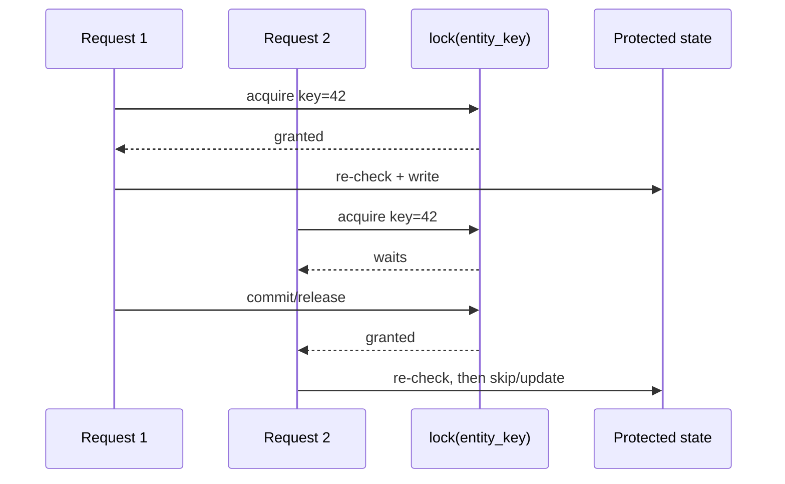
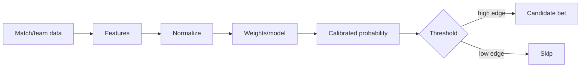
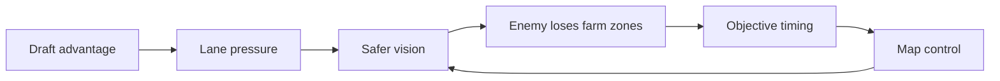

# Examples

These examples demonstrate the intended behavior across domains. They are examples, not a whitelist.

## Example 1 — race condition / lock contention

User:

> Explain how this advisory lock avoids a race condition when several parallel requests hit the same entity.

Good response shape:

````markdown
### Mental model

The lock turns “parallel writes to the same entity” into a queue for one deterministic key.



### Why it works

Invariant: for one entity key, only one request can execute the check-and-write section at a time.

### Paper notes

- Same key → serialized critical section.
- Re-check after waiting.
- Paths that skip the lock can still race.
````

## Example 2 — scoring model / sports prediction

User:

> Explain how the scoring model should turn match data into a confidence score.

Good response shape:

````markdown
### Mental model

Treat scoring as a pipeline: raw signals become normalized features, features become a calibrated probability, probability becomes a decision.



| Stage | Job | Risk |
|---|---|---|
| Features | capture useful signal | leakage / noisy data |
| Model | combine signals | overfitting |
| Calibration | make scores mean real probability | false confidence |
| Threshold | decide action | too many weak bets |

### Paper notes

- Score is not “truth”; it is calibrated confidence.
- Separate prediction quality from betting decision threshold.
- Avoid data leakage before trusting backtests.
````

## Example 3 — math / probability

User:

> Explain Bayes’ theorem visually so I can write it into notes.

Good response shape:

````markdown
### Mental model

Bayes updates belief: prior belief + evidence quality → posterior belief.

```text
Prior P(H)
   │
   ├─ evidence likely if H:     P(E|H)
   └─ evidence likely if not H: P(E|¬H)
        ↓
Posterior P(H|E)
```

```text
P(H|E) = P(E|H) · P(H) / P(E)
```

### Paper notes

- Prior = belief before evidence.
- Likelihood = how expected the evidence is under the hypothesis.
- Posterior = updated belief after evidence.
````

## Example 4 — non-technical/game strategy

User:

> Explain on a Dota example how draft advantage snowballs into map control.

Good response shape:

````markdown
### Mental model

Draft advantage matters when it converts into repeated low-risk map actions, not just “strong heroes”.



### Why it snowballs

The loop is self-reinforcing: pressure gives vision, vision makes farming safer for one team and riskier for the other, which creates objective timings.

### Paper notes

- Draft advantage is useful when it creates repeatable safe actions.
- Vision and farm zones are the bridge between lanes and objectives.
- Snowball = feedback loop, not one isolated fight.
````

## Example 5 — simple naming should not trigger visual mode

User:

> Why did you name this variable `normalizedEmail`?

Good response:

````markdown
Because it is no longer raw input. The value has already been trimmed/lowercased, so `normalizedEmail` makes later comparisons easier to read than a generic `email`.
````

No diagram. No table.

## Example 6 — urgent answer should stay fast

User:

> Production is broken. Very quickly: do we need the lock here?

Good response:

````markdown
Yes, if multiple app instances can process the same entity concurrently. Put the lock around the check-and-write section and re-check the state after acquiring it.

Tiny model:

```text
A: lock → re-check → write → release
B: waits ───────────┘ re-check → skip/update
```

Do not rely on an in-memory lock unless there is only one process.
````

## Example 7 — explicit HTML artifact

User:

> Make an interactive HTML explanation of this onboarding funnel so I can open it in a browser.

Good behavior:

- Create one self-contained `.html` file.
- Include a visual funnel/pipeline, step toggles, comparison or failure paths, and printable notes.
- Use no remote dependencies.
- Mention the file path.
