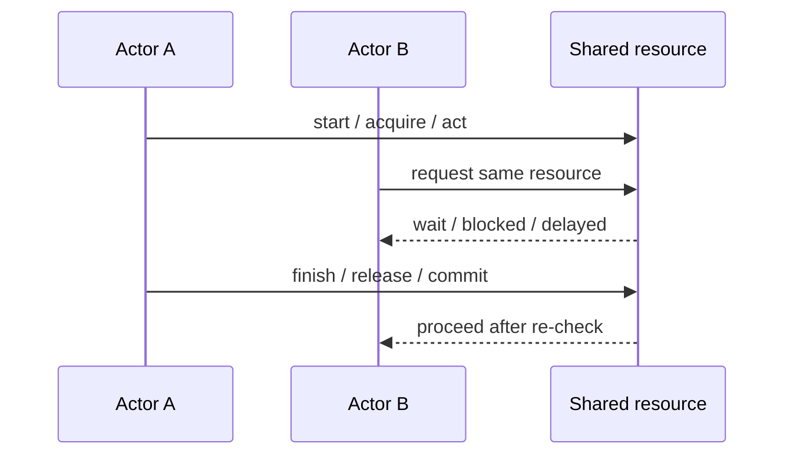
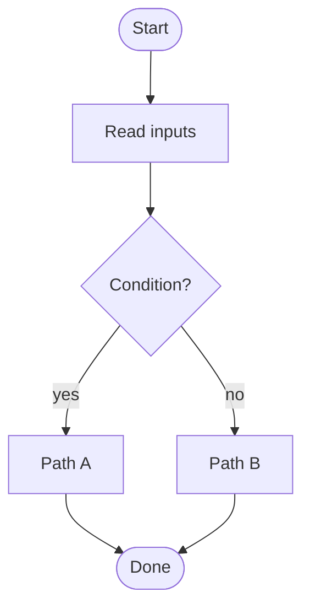
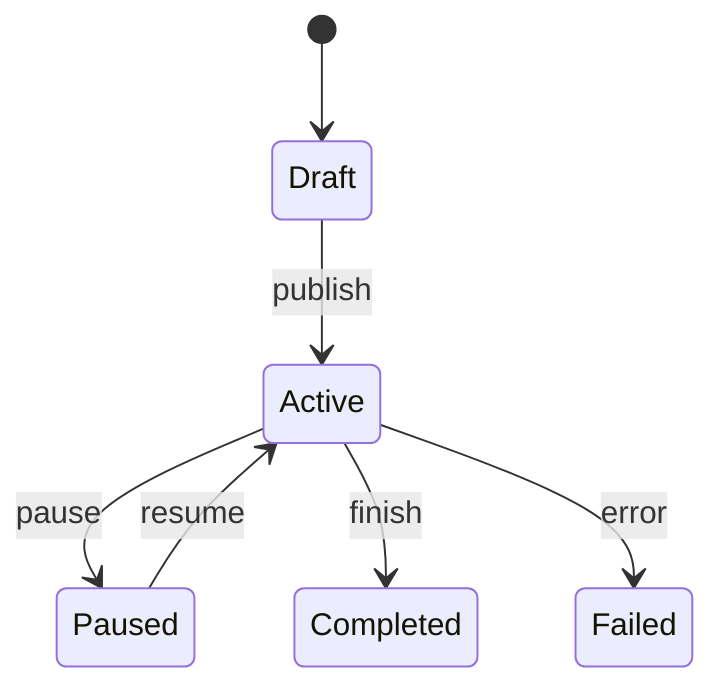
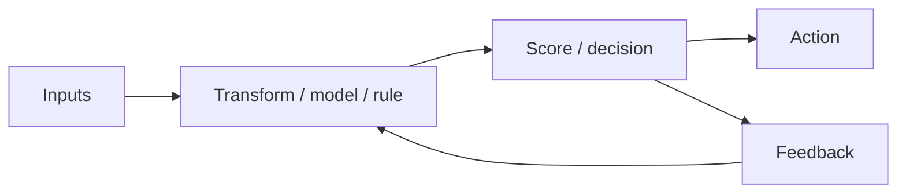
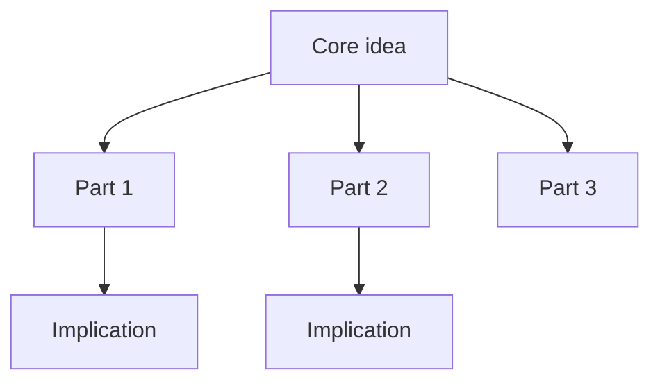

# Visual patterns

Use these as templates. Adapt language, labels, and detail level to the user.

## 1. Sequence / swimlane: actors over time

Use for parallel requests, lock contention, turn order, handoffs, approvals, game fights, negotiations, and any “who acts when?” explanation.



Key teaching points:

- who can act in parallel;
- who must wait;
- what must be re-checked after waiting;
- where the invariant is enforced.

## 2. Flowchart: process or decision path



Use for validation, algorithms, onboarding, workflows, diagnosis, and fallback logic.

## 3. State machine: lifecycle



Use for order status, job lifecycle, retry systems, user journey stages, game phases, and learning phases.

## 4. Component / data-flow diagram



Use for architecture, models, scoring, pipelines, ETL, analytics, content systems, and cause/effect loops.

## 5. Formula + pipeline

Use when numbers matter but the user needs intuition.

```text
Inputs → Normalize → Weight → Combine → Calibrate → Decision
```

| Part | Meaning | Watch out |
|---|---|---|
| Input | What enters the model | missing/noisy data |
| Weight | How much it matters | overfitting / bias |
| Threshold | When action happens | false positives/negatives |

## 6. Probability tree

```text
Start
├─ Event A: p(A)
│  ├─ Success: p(B|A)
│  └─ Fail:    1 - p(B|A)
└─ Not A: 1 - p(A)
   ├─ Success: p(B|¬A)
   └─ Fail:    1 - p(B|¬A)
```

Use for Bayes, risk, expected value, forecasting, sports prediction, A/B tests, and decision uncertainty.

## 7. Trade-off matrix

Use when the user asks “why this choice?” or several viable options exist.

| Option | Strength | Weakness | Best fit | Avoid when |
|---|---|---|---|---|
| Option A | ... | ... | ... | ... |
| Option B | ... | ... | ... | ... |
| Option C | ... | ... | ... | ... |

End with a decision rule: “choose X when ..., choose Y when ...”.

## 8. Concept map



Use for abstract concepts, theory, strategy, taxonomy, and “big picture” explanations.

## 9. Paper notes block

End non-trivial explanations with compact copyable notes:

```text
Конспект на бумагу:
- Главная идея: ...
- Инвариант / правило: ...
- Опасность: ...
- Когда применять: ...
```
